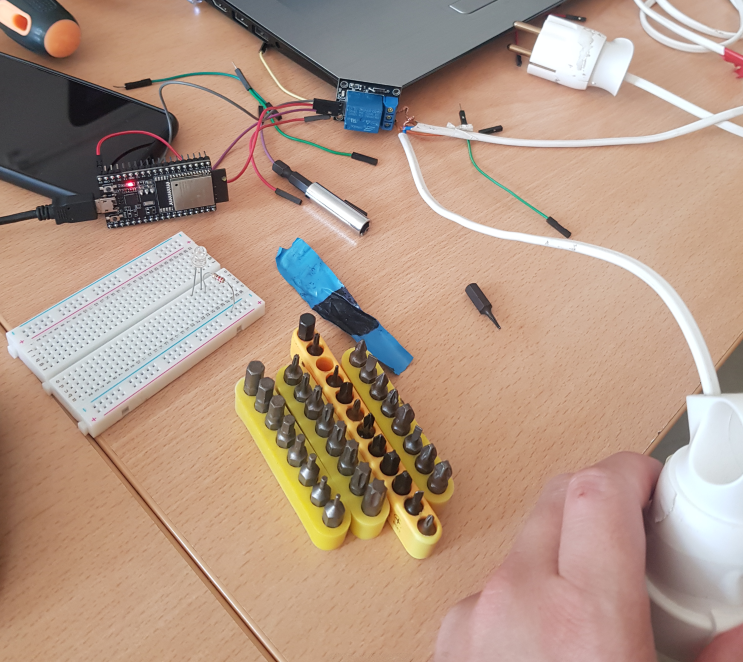

# ESP32 Telegram Smart Switch
This project is an IoT smart switch solution that allows you to control high-voltage home appliances remotely using an ESP32 microcontroller and the Telegram messaging app. By leveraging a relay module, the system safely bridges the gap between low-voltage digital electronics and household appliances. It includes a security layer to ensure that only you—the authorized owner—can trigger the device, making it a reliable and private home automation tool.

## 🛠️  Technologies

- **UniversalTelegramBot:** This is the core library that handles the complexity of the Telegram Bot API. Instead of you writing raw code to interact with web servers, this library acts as a translator. It converts your C++ commands into secure HTTPS requests, manages the polling mechanism to check for new messages, and automatically parses the complex JSON responses from Telegram into easy-to-use C++ variables.

- **ArduinoJson:** Telegram's API communicates primarily through JSON (a data format). This library is responsible for deconstructing those data packets, allowing your ESP32 to "read" the sender's name, the chat ID, and the specific text command contained within the message.

> **Note:** The `UniversalTelegramBot` library relies on `ArduinoJson` to function. It uses `ArduinoJson` as its "engine" to parse the raw data received from Telegram servers, converting it into a format that your ESP32 can easily process.

## 🤖 Commands and operational logic

To control your device, send the following commands to your bot:

| Command | Description |
| :--- | :--- |
| `/start` | Initializes communication and displays the available menu. |
| `/led_on` | Activates the relay (turns the appliance ON). |
| `/led_off` | Deactivates the relay (turns the appliance OFF). |
| `/state` | Requests the current status of the relay (ON or OFF). |

### How it Works 

Your ESP32 continuously performs "Long Polling" using the `bot.getUpdates()` function.

1. **Request:** Every second, the ESP32 sends an HTTP GET request to Telegram’s servers asking: "Are there any new messages?"
2. **Response:** Telegram replies with a JSON object containing the message details.
3. **Parsing:** The `UniversalTelegramBot` library parses this JSON, extracting the `chat_id` and the message text.
4. **Reaction:** Your code checks if the sender's `chat_id` matches your pre-defined `CHAT_ID`. If verified, the ESP32 executes digitalWrite() to the relay pin. The relay then physically connects or disconnects the high-voltage circuit, allowing the appliance to respond to your digital command.

## ⚡ Wiring scheme

To set up the hardware, you need to manage two separate circuits: the low-voltage control side (ESP32) and the high-voltage mains side (the appliance).

### Low-Voltage (Control) Side
This connects the ESP32 to the relay module:  
  
1. VCC (Relay) $\rightarrow$ 5V (ESP32)  
2. GND (Relay) $\rightarrow$ GND (ESP32)  
3. IN (Relay) $\rightarrow$ GPIO 4 (ESP32)  

### High-Voltage (Mains) Side
Before proceeding, ensure the power cord is unplugged from the wall outlet.

- **The Concept:** You are not powering the lamp through the ESP32. Instead, you are using the relay as a remote-controlled mechanical switch that interrupts one of the wires in your power cord.

1. Cut the live wire (usually the brown/black wire) inside your extension cord.
2. Connect the end coming from the plug to the COM (Common) terminal on the relay.
3. Connect the end going to the lamp to the NO (Normally Open) terminal.
4. The neutral wire (usually blue) remains connected directly from the plug to the lamp.

  
    

> **⚠️ WARNING:** This project involves 220V AC mains electricity. **Always disconnect from the power supply before wiring.** Ensure your relay module is rated to handle the voltage and current of the appliance you intend to control. The relay acts as an air-gap switch, completely isolating the ESP32's 3.3V logic from the dangerous high-voltage line.

## 🚀 Setup and configuration

### 1. Prerequisites
Before starting, ensure you have the following components and accounts:
* **ESP32 Development Board**
* **Relay Module**
* **Telegram App** (on your phone or PC)
* **PlatformIO Extension** (in VS Code)

### 2. Bot Registration
* **Token (`BOTtoken`):** Obtain this from **@BotFather** on Telegram. It acts as your bot's "password."
* **Chat ID (`CHAT_ID`):** Your personal Telegram identifier, obtained from **@userinfobot**. It acts as a "bouncer" to ensure only you can control the device.

### 3. Installation
1. **Configuration:** Update the `ssid` and `password` variables in your `main.cpp` to match your home Wi-Fi.
2. **Wiring:** Connect the ESP32 to the relay module.
3. **Upload:** Connect your ESP32 to your computer and click "Upload" in PlatformIO.

> **⚠️ SECURITY NOTE:** While your `CHAT_ID` acts as a "bouncer" to prevent unauthorized commands, never push your `main.cpp` with your actual `BOTtoken` to a public repository. If your token is exposed, anyone can access your bot's history or send messages to it, even if they cannot trigger your relay. Always use environment variables or a separate configuration file (added to your `.gitignore`) to keep your credentials private.
